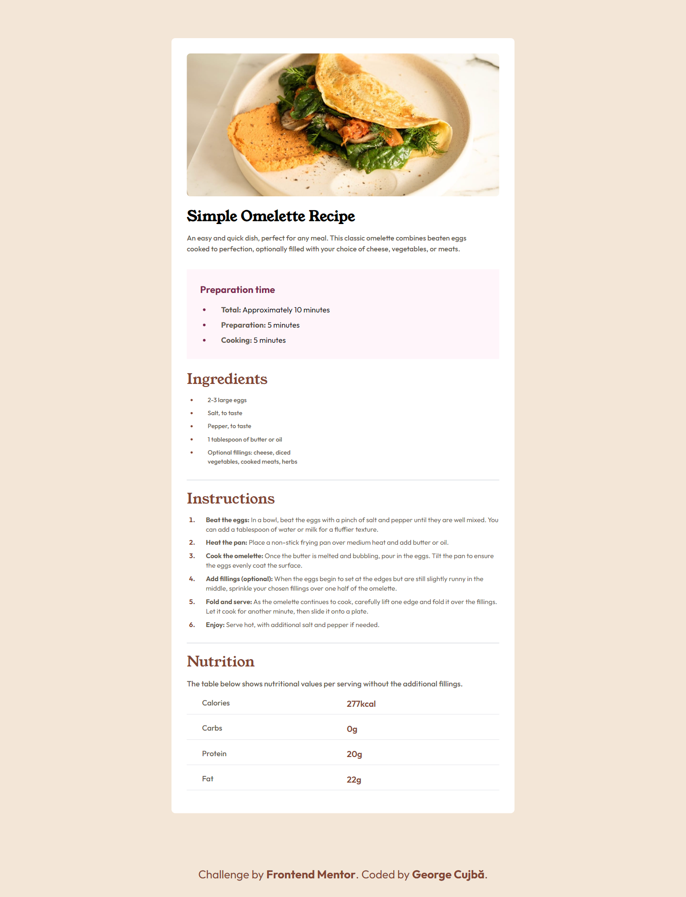

# Frontend Mentor - Social links profile

This is a solution to the [Recipe Page on Frontend Mentor](https://www.frontendmentor.io/challenges/recipe-page-KiTsR8QQKm/hub). Frontend Mentor challenges help you improve your coding skills by building realistic projects.

## Table of contents

- [Overview](#overview)
  - [The challenge](#the-challenge)
  - [Screenshot](#screenshot)
  - [Links](#links)
- [My process](#my-process)
  - [Built with](#built-with)
  - [What I learned](#what-i-learned)
- [Author](#author)

### Screenshot

### Links

- Live Site URL: [Hosted with Github Pages](https://georgevalentin.github.io/Recipe_Page/)

## My process

### Built with

- Semantic HTML5 markup
- Tailwind CSS
- Responsive Design

### What I learned

I got to build a webpage using TailWind CSS

## Author

- Github - [GeorgeCujbă](https://github.com/GeorgeValentin/)
- Frontend Mentor - [@GeorgeCujbă](https://www.frontendmentor.io/profile/GeorgeValentin)
